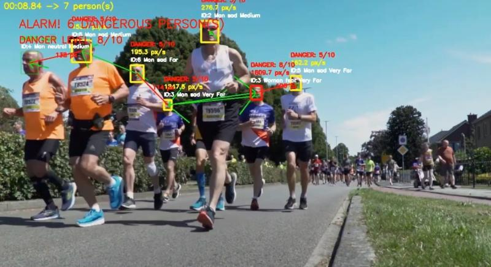
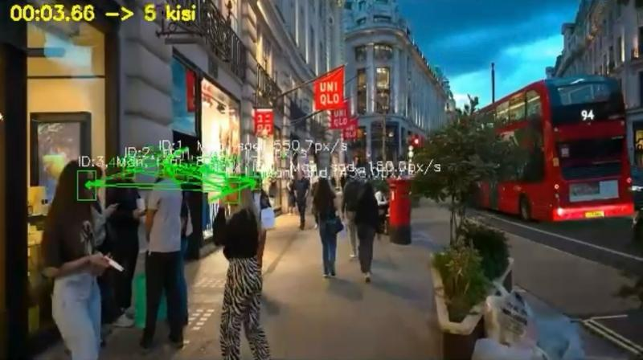

# Gerçek Zamanlı İnsan Davranışlarına Dayalı Tehlikeli Durum Tespit Sistemi

<div align="center">


Bu proje, video akışları üzerinden insan davranışlarını analiz ederek potansiyel tehlikeli durumları gerçek zamanlı olarak tespit eden yapay zeka tabanlı bir güvenlik analiz sistemidir. Sistem; yüz tespiti, kişi takibi, davranışsal özellik çıkarımı, çok faktörlü risk skorlama, olay bazlı loglama ve LLM destekli raporlama bileşenlerinden oluşan entegre bir mimari üzerine inşa edilmiştir.

Amaç, yalnızca nesne veya yüz tespiti yapmak değil; zamansal davranış değişimlerini analiz ederek risk üretmek ve bu riski açıklanabilir şekilde raporlamaktır.

</div>

---
##  Sistem Görselleri

<div align="center">
  
  <br><br>
  
</div>


---

## 1. Sistem Mimarisi

Sistem aşağıdaki çok katmanlı veri akışı ile çalışır:

Video Stream / Dosya / Kamera
↓  
Face Detection (DeepFace / RetinaFace)  
↓  
Multi-Object Tracking (Norfair – Track ID üretimi)  
↓  
Davranışsal Özellik Çıkarımı  
- Duygu analizi  
- Cinsiyet tahmini  
- Anlık hız hesaplama  
- Kişiler arası mesafe ölçümü  

↓  
Risk Skorlama Motoru  
↓  
SQLite Veritabanı Loglama  
↓  
LLM Tabanlı Olay Raporlama (Ollama)  
↓  
Web Tabanlı Yönetim Paneli  

Bu mimari, gerçek zamanlı analiz ile olay sonrası incelemeyi aynı sistem içinde birleştirir.

---

## 2. Davranış Tabanlı Risk Skorlama

Sistem, klasik güvenlik yaklaşımlarının aksine yalnızca nesne tespiti yapmaz. Bunun yerine bireylerin zamansal davranış parametrelerini analiz eder.

Risk skoru aşağıdaki faktörlerin birleşimi ile hesaplanır:

- Duygu durumu (agresif, korku, stres vb.)
- Anlık hız ve hız değişimi
- Kişiler arası mesafe
- Kritik faktör kombinasyonları (örneğin: yüksek hız + düşük mesafe + agresif duygu)

Risk değeri 0–10 aralığında normalize edilir.  
Tanımlanan eşik değerinin aşılması durumunda sistem alarm üretir.

Bu yapı sayesinde sistem, potansiyel tehlikeyi davranışsal örüntü üzerinden değerlendirebilir.

---

## 3. Veri Kaydı ve Olay Loglama (SQLite)

Sistem analiz sırasında üretilen tüm zamansal ve olay bazlı çıktıları SQLite veritabanında saklar. Bu yaklaşım hafif, taşınabilir ve kurulumsuz bir veri katmanı sağlar.

### 3.1 Timestamp Bazlı Kişi Kayıtları

Her frame (zaman damgası) için tespit edilen her birey ayrı kayıt olarak tutulur. Aynı anda birden fazla kişi bulunuyorsa her biri bağımsız şekilde loglanır.

Her kayıt aşağıdaki bilgileri içerir:

- Track / Person ID  
- Cinsiyet tahmini  
- Duygu durumu  
- Anlık hız  
- Kişiler arası mesafe  

Bu yapı, bireylerin zaman içindeki davranış değişimini analiz etmeye olanak tanır ve ileri düzey istatistiksel değerlendirme için veri altyapısı oluşturur.

### 3.2 Alarm / Olay Kayıtları

Risk skoru eşik değerini aştığında olay kaydı oluşturulur. Alarm kayıtları kişi kayıtlarından ayrı şekilde tutulur ve olay odaklıdır.

Her alarm kaydı:

- Alarm zamanı  
- Risk seviyesi  
- Tetikleyen faktörler  
- Olayla ilişkili kişi ID’leri  

içerir.

Bu veriler;

- Kritik olay analizi  
- Geçmiş güvenlik değerlendirmesi  
- LLM tabanlı rapor üretimi  

için kullanılır.

---

## 4. LLM Tabanlı Olay Raporlama

Sistem, kritik alarm verilerini filtreleyerek yerel LLM (Ollama – Llama 3.2:3B) ile doğal dilde analiz raporu üretir.

Rapor aşağıdaki unsurları içerebilir:

- Olay özeti  
- Risk değerlendirmesi  
- Davranış analizi  
- Olası tehlike yorumu  

Rapor çıktısı metin dosyası olarak oluşturulur ve isteğe bağlı olarak dış sistemlere iletilebilir.

---

## 5. Web Tabanlı Yönetim Paneli

Flask tabanlı arka uç ile geliştirilen web arayüzü:

- Gerçek zamanlı analiz durumu takibi  
- Alarm görüntüleme  
- Geçmiş kayıt inceleme  
- Kullanıcı doğrulama ve oturum yönetimi  

özelliklerini içerir.

Sistem, arka plan işleme ve analiz ilerleme takibi mekanizmaları ile çalışır.

---

## 6. Teknoloji Stack

### AI / Computer Vision
- DeepFace
- RetinaFace
- Norfair
- OpenCV
- TensorFlow

### Backend
- Flask
- SQLite
- Session-based Authentication

### Veri İşleme
- NumPy
- Pandas
- Matplotlib

### LLM
- Ollama (llama3.2:3b)
- Özel prompt mühendisliği

---

## 7. Kurulum

```bash
git clone https://github.com/username/SecurityVision.git
cd SecurityVision
python -m venv .venv
.venv\Scripts\activate
pip install -r requirements.txt
python app.py
